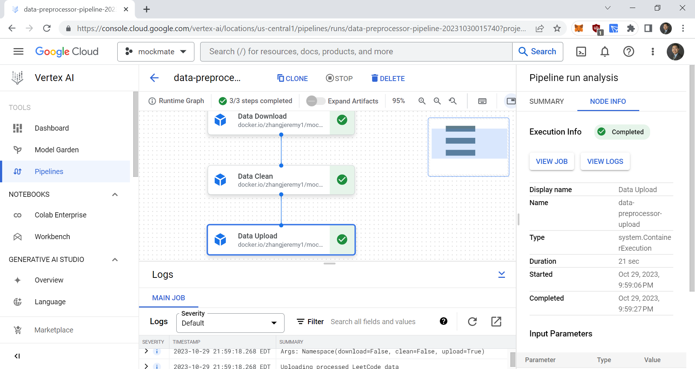

AC215_Mockmate
==============================

Project Organization
------------
```
.dvc/  
├─ .gitignore  
└─ config
notebooks/
├─ mockmate_quantization.ipynb
src/  
├─ api-frontend/  
│  └─ app/  
│     ├─ main.py  
│     └─ __init__.py  
├─ data-versioning/  
│  ├─ .gitignore  
│  ├─ cli.py  
│  ├─ docker-shell.sh  
│  ├─ Dockerfile  
│  ├─ leetcode_dataset_embeddings.dvc  
│  └─ requirements.txt
├─ model/
│  ├─ .gitignore  
│  ├─ Dockerfile  
│  ├─ docker-shell.sh  
│  ├─ finetune.py 
│  ├─ loader.py
│  ├─ prepare.py
│  ├─ query.py
│  ├─ requirements.txt
│  └─ training_data.dvc
├─ preprocessing/  
|  ├─ .gitignore  
|  ├─ docker-shell.sh
|  ├─ Dockerfile  
|  ├─ Pipfile  
|  ├─ Pipfile.lock  
|  └─ preprocess_cli.py  
└─  workflow/
   ├─ Dockerfile  
   ├─ Pipefile
   ├─ Pipfile.lock
   ├─ cli.py
   ├─ data_preprocessor.yaml
   ├─ docker-entrypoint.sh
   └─ docker-shell.sh
.dvcignore  
.gitignore  
LICENSE  
README.md  
requirements.txt
```
--------

# AC215 - Mockmate

**Team Members**  
Jeremy Zhang, Andrew Sima, Rudra Barua

**Group Name**  
Mockmate

**Project**  
In this project, our goal is to build an application that can simulate software engineering job interviews by generating technical questions relevant to the domain. This platform will also evaluate candidates' responses in real-time, offering feedback on coding efficiency and response quality.

## Milestone 5 ##

**Architecture Diagrams**

Here is our **solution architecture** that details our intended usage processes for our application.


Likewise, below is our **technical architecture** that details our workflows for both users and devs/scientists in  interacting with our application.


**Backend API**

We built backend API service using fast API to expose the model to the frontend. We also added additional endpoints to support other features of Mockmates, such as getting the solution and explaination from the Leetcode data we originally collected.


**Frontend**

TODO

**Deployment Procedure**

The following commands detail commands that can be used to deploy all of our app containers. The deployment is to GCP and all docker images go to GCR. 

- Build and Push Docker Containers to GCR (Google Container Registry)
```
ansible-playbook deploy-docker-images.yml -i inventory.yml
```

- Create Compute Instance (VM) Server in GCP
```
ansible-playbook deploy-create-instance.yml -i inventory.yml --extra-vars cluster_state=present
```

- Provision Compute Instance in GCP
Install and setup all the required things for deployment.
```
ansible-playbook deploy-provision-instance.yml -i inventory.yml
```

- Setup Docker Containers in the  Compute Instance
```
ansible-playbook deploy-setup-containers.yml -i inventory.yml
```

- Setup Webserver on the Compute Instance
```
ansible-playbook deploy-setup-webserver.yml -i inventory.yml
```
Once the command runs go to `http://<External IP>/`, which can be retrieve from the instance IP returned. 

After executing the commands above correctly, you should be able to see the following deployed instance in the GCP VM dashboard. 


## Milestone 4 ##

### Model Optimization ###

**Model Loading with 8-Bit Quantization:**
In our intial optimization, we applied 8-bit quantization when loading the model. The major benefit of 8-but quantization is the significant reduction in model size and faster inference times. 

**Low-Rank Adaptation (LORA):**
Low-Rank Adaptation (LORA) is a technique designed to adapt large pre-trained models, especially when the downstream task have limited available data. Instead of fine-tuning the entire pre-train OpenLlama model, LORA adds low-rank matrices to the pre-existing layers. This allows our model to learn task-specific information with a limit number of parameters. In the 'LoraConfig' object we specify configuration such as the rank of the added matrices (`r=16`), and which specific layersto target for adaptation.

**Half-Precision (16-bit) Training:**
We used half-precision training to utilize 16-bit floating-point numbers instead of the conventional 32-bit numbers for reduced precision training. By halving the precision, we reduced memory consumption and enabled the use of larger batch sizes. 


### Vertex AI Pipelines ###

#### Setup GCP Service Account
- Here are the step to create a service account:
- To setup a service account you will need to go to [GCP Console](https://console.cloud.google.com/home/dashboard), search for  "Service accounts" from the top search box. or go to: "IAM & Admins" > "Service accounts" from the top-left menu and create a new service account called "ml-workflow". For "Service account permissions" select "Storage Admin", "AI Platform Admin", "Vertex AI Administrator", "Service Account User".
- This will create a service account
- On the right "Actions" column click the vertical ... and select "Manage keys". A prompt for Create private key for "ml-workflow" will appear select "JSON" and click create. This will download a Private key json file to your computer. Copy this json file into the **secrets** folder. Rename the json file to `ml-workflow.json`

#### Setup Docker Containers to be Callable

To ensure that the Docker containers could be used by the Vertex AI pipeline, we needed to add a `docker-entrypoint.sh` file and make a few modifications to each `Dockerfile`. We then needed to rebuild each Docker image by running

```
docker build -t <IMAGE_NAME> -f Dockerfile .
```
We then pushed each Docker image to the online Docker registry by running
```
docker push <IMAGE_NAME>
```
Please see the `Results` section below for a screenshot of all the Docker images pushed to the online Docker registry.

#### Create Vertex AI pipelines/workflows

We then created the folder `src/workflow` which contains `cli.py` and all of the `.yaml` files generated for the various workflows. To submit a workflow to run on Vertex AI, first start up the Docker container in the workflow folder by running

```
./docker-shell.sh
```
Once inside the Docker container, you can run the following commands:

For the data preprocessing pipeline, run
```
python cli.py -d
```
For the data versioning/embeddings generation pipeline, run
```
python cli.py -v
```
For the model fine tuning pipeline, run

```
python cli.py -m
```
Please see the `Results` section below for a screenshot of an example of a successful pipeline run.

#### Results

We created Vertex AI pipelines for the various flows. First, we needed to build and push all of our Docker files to the public Docker registry so they can be pulled down. You can see them [here](https://hub.docker.com/repositories/zhangjeremy1), or view the screenshot below.


We also added a new `workflow` folder that contains the `cli.py` file for the various workflows that can be run. Here is a screenshot of one such Vertex AI pipeline being run:



## Milestone 3 ##

In this milestone, we wrote a parallel data processing pipeline using Dask to properly format a previously collected dataset in "Alpaca form", a convenient response/answer format we picked specifically for fine-tuning our LLM. We added onto our previous data version control pipeline by adding support for saving and loading models from DVC. We also implemented the fine-tuning script that processes the training data and trains the model using libraries provided by HuggingFace. Finally, we added the necessary functionality to pass user provided prompts to our fine-tuned model. Before running any of the commands below, make sure to set the appropriate env variables specified in `docker-shell.sh`

### Distributed/Parallel Data Computation ###

The `prepare.py` Python script processes LeetCode data retrieved from a Google Cloud Storage bucket. We read the Leetcode data into a Dask Bag object for cleaning. We then used the Delayed computation paradigm to transform the data for training using parallel processing. You can run this with the following:

```
python prepare.py
```

Then you can register the training data to DVC using:

```
dvc add src/model/training_data

dvc push 
```

### Saving and Loading Model Weights from DVC ###

The `loader.py` Python script facilitates downloading versioned machine learning models from a DVC. The CLI tool always pulls the most up-to-date version of the model. You can run this with the following:

```
python loader.py -p
```

Similarly, you can also register new model weights to DVC using:

```
dvc add src/model/trained_model

dvc push 
```

### Fine-tuning Step ###

The `finetune.py` script fine-tunes a language model using the Hugging Face Transformers library. It starts by loading our preprocessed dataset, then splitting it into training and validation sets. The model is based on `open_llama_3b_v2`. We use quantization and Learned Rank Adaptation (LoRA) to finetune the model. See source code for more detailed training parameters such as batch size, learning rate, and optimization strategies.

The core training logic utilizes the `Trainer` class from the `transformers` library. We used a custom iterable dataset class    `ConstantLengthDataset` to convert the training data into tensors. The trained model is saved to the local `trained_model` folder so that we can save it to DVC. You can run this with the following:

```
python finetune.py
```

### Querying the Model with User Input ###

The `query.py` script will follow up the finetune step and load a pre-trained language model and its corresponding tokenizer from the  local `trained_model` directory. It continuously accepts user queries, processes them using the loaded model, and outputs the generated responses (note that it is quite slow, currently ~45s a query). Assuming the model has already been pulled to the local `trained_model/` directory, you can run this with the following:

```
python query.py
```

## Milestone 2 ##

In this milestone, we gathered data about [Leetcode](https://leetcode.com/problemset/all/) questions, cleaned the data, versioned the data, and generated a rudimentary set of embeddings in support for training for the next milestone. We also devloped a set of atomic containers that runs each of the steps as well as a pipeline to push all the various pieces of processed data into GCP buckets.

### Instructions for Running Leetcode Data Processing Pipeline:

#### Setup GCP Credentials
To follow the process step by step on your local machine, you will need to first configure some settings about GCP, including the creation of a secrets folder. The following instructions are adapted from the [example repo]():

#### Create a local **secrets** folder

It is important to note that we do not want any secure information in Git. So we will manage these files outside of the git folder. At the same level as the `data-labeling` folder create a folder called **secrets**

Your folder structure should look like this:
```
   |-api-frontend
   |-data-versioning
   |-preprocessing
   |-secrets
```

#### Setup GCP Service Account
- Here are the step to create a service account:
- To setup a service account you will need to go to [GCP Console](https://console.cloud.google.com/home/dashboard), search for  "Service accounts" from the top search box. or go to: "IAM & Admins" > "Service accounts" from the top-left menu and create a new service account called "data-service-account". For "Service account permissions" select "Cloud Storage" > "Storage Admin" (Type "cloud storage" in filter and scroll down till you find). Then click continue and done.
- This will create a service account
- On the right "Actions" column click the vertical ... and select "Manage keys". A prompt for Create private key for "data-service-account" will appear select "JSON" and click create. This will download a Private key json file to your computer. Copy this json file into the **secrets** folder. Rename the json file to `data-service-account.json`

### Preprocessing

To start, we sourced data from [Kaggle](https://www.kaggle.com/datasets/erichartford/leetcode-solutions) that included all Leetcode questions. For each question, the text of the question, an editorial solution in English, constraints, example input/outputs, as well as solutions in various programming languages (C++, Java, Python, etc.) were provided.

In this preprocessing step, we first download the raw data from Kaggle, then clean the data by separating each problem's components into its individual pieces (separating out the example input/outputs from the problem text, separating out the solutions in different languages, etc.), and re-uploading the cleaned Leetcode data that we collected to our GCP bucket. The first step is to get the Docker container up and running:

```
./docker-shell.sh
```

Once inside the container, to download, run:

```
python preprocess_cli.py -d
```

Then to clean, run:

```
python preprocess_cli.py -c
```

and finally to upload the cleaned data run:


```
python preprocess_cli.py -u
```

### Data Versioning

This is the post processing container for generating vector embeddings off of the cleaned leetcode data from the preprocessing container. Similar to the above section, first get into the Docker container:

```
./docker-shell.sh
```

Once inside the docker container, we first activate the virtual environment with 

```
. venv/bin/activate
```

Then we can run:

```
python cli.py -d -c 100 # the count arg specifies for how many problems we want to generate vector embeddings
```

Keep in mind that it takes around 30-40s to generate an embedding for a given leetcode problem, with there being ~2360 leetcode problems in entire dataset.

### Push data to DVC

The vector embeddings that we have are saved to the leetcode_dataset_embeddings folder. To reupload the data, make sure that you have the google cloud credentials correctly configured. You can do this via something similar to the following command (make sure to run in dvc root). 

```
dvc remote modify --local src/data-versioning/leetcode_dataset_embeddings \
                    credentialpath '<your secrets path>'
```

Then to update dvc for newly generated embeddings, run:

```
dvc add src/data-versioning/leetcode_dataset_embeddings

dvc push 
```
